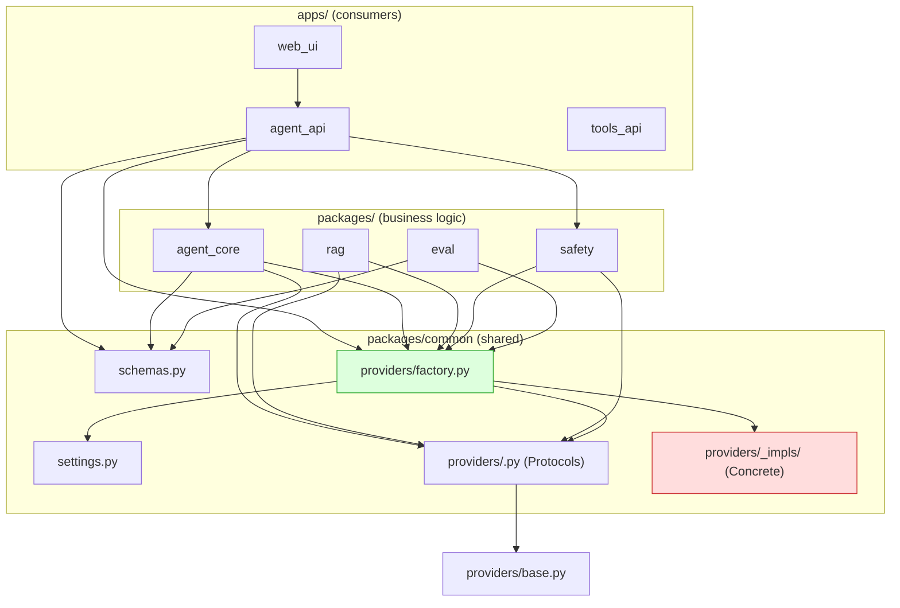
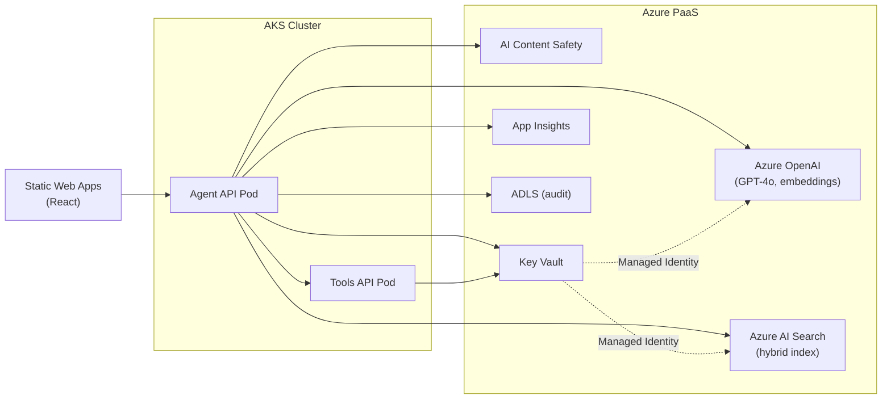

# Servicing Agent — Architecture

> **Status:** Living document — update after every ADR or structural change.
> **Source of truth:** [`docs/01-servicing-agent-prompts.md`](docs/01-servicing-agent-prompts.md) §A.
> **ADRs:** [`decisions.md`](decisions.md).

> **2026-09-29 (ADR-010):** `apps/tools_api` (:8001) **removed**. Loan answers use
> live SSE OpenAPI via `packages/sse` (`search_sse_apis` → `call_sse_api`) on Agent
> API `:8000` (`/chat`, `/mcp/tools`). UI borrower lookup uses the same MCP path.
> Sections below that still describe Agent MCP / packages.sse are **historical** — ignore for runtime.


---

## 1. System Overview

The **Servicing Agent** is an internal copilot for licensed mortgage-servicing care
representatives at a Tier-1 US mortgage servicer. It retrieves policy/SOP content via
RAG, calls read-only loan tools, drafts citation-grounded replies, and presents them
for human approval — all while enforcing PII redaction and content-safety controls.

The system is designed as a **hybrid, local-first architecture**: the identical Python
codebase runs locally (Ollama + Qdrant) or on Azure (AOAI + AI Search) with no code
changes — only environment-variable swaps.

```
┌───────────────────────────────────────────────────────────────────────┐
│                         Rep (React UI)                               │
│   Two-pane: borrower context │ conversation + citations + trace     │
└────────────────────────────┬──────────────────────────────────────────┘
                             │ HTTP
┌────────────────────────────▼──────────────────────────────────────────┐
│                      Agent API  (FastAPI :8000)                       │
│  POST /chat (SSE)  │  GET /health  │  GET /version                   │
│  ┌─────────────────────────────────────────────────────────────────┐  │
│  │  Safety Middleware (PII ▸ inbound, Content Safety ▸ outbound)  │  │
│  └────────────────────────────┬────────────────────────────────────┘  │
│  ┌────────────────────────────▼────────────────────────────────────┐  │
│  │  Agent Core (Microsoft Agent Framework)                        │  │
│  │  System prompt │ Intent router │ Output parser │ Retry logic   │  │
│  └───┬────────────┬──────────────┬────────────────────────────────┘  │
│      │ LLM        │ RAG          │ Tools                             │
│      ▼            ▼              ▼                                   │
│  ChatProvider  VectorStore   ToolsClient                             │
│  (factory)     + Embedding   Provider                                │
│                (factories)   (factory)                                │
└──────────────────────────────────────────────────────────────────────┘
                                   │ HTTP
┌──────────────────────────────────▼───────────────────────────────────┐
│                      SSE tools in-process (packages/sse — was Agent MCP / packages.sse)                      │
│  Bearer auth │ 5 read-only endpoints │ data/loans.json backing      │
└──────────────────────────────────────────────────────────────────────┘
```

---

## 2. Module Layout

```
LoanOps Agent_Demos/
├── apps/
│   ├── agent_api/        # FastAPI :8000  — /chat (SSE), /health, /version
│   ├── sse/               # OpenAPI catalog + live call_sse_api (tools_api removed)
│   └── web_ui/           # React + TypeScript rep UI (Vite)
│
├── packages/
│   ├── agent_core/       # Microsoft Agent Framework agent, prompt loader, intent router
│   ├── rag/              # Chunker, ingest CLI, retrieval orchestration
│   ├── safety/           # PII redaction + content-safety middleware
│   ├── eval/             # Ragas + custom metrics, golden runner, CI gate
│   └── common/
│       ├── settings.py   # Pydantic Settings — single source of all env config
│       ├── schemas.py    # Shared Pydantic models (AgentTurnOutput, etc.)
│       └── providers/    # ★ Provider Abstraction layer (load-bearing)
│           ├── base.py           # ProviderHealth, ProviderError, ModelHint
│           ├── factory.py        # get_chat_provider(), get_*_provider()
│           ├── chat.py           # ChatProvider Protocol + impls
│           ├── embedding.py      # EmbeddingProvider Protocol + impls
│           ├── vector_store.py   # VectorStoreProvider Protocol + impls
│           ├── pii.py            # PiiProvider Protocol + impl
│           ├── content_safety.py # ContentSafetyProvider Protocol + impls
│           ├── audit_sink.py     # AuditSinkProvider Protocol + impls
│           ├── secrets.py        # SecretsProvider Protocol + impls
│           ├── telemetry.py      # TelemetryProvider Protocol + impls
│           ├── tools_client.py   # ToolsClientProvider Protocol + impls
│           ├── prompt_store.py   # PromptStoreProvider Protocol + impls
│           ├── testing.py        # InMemory<X>Provider for unit tests
│           └── contract_tests/   # pytest suites every impl must pass
│
├── data/
│   ├── sops/             # ~39 synthetic markdown SOPs (YAML frontmatter)
│   ├── loans.json        # 50 synthetic loans (CA/TX/FL/NY/OH)
│   └── golden.jsonl      # 50 Q&A golden items (eval harness)
│
├── infra/                # ⚠ Planned (Step 10) — not yet implemented
│   ├── bicep/            # Azure IaC (AOAI, AI Search, AKS, KV, MI, etc.)
│   └── scripts/          # azd hooks
│
├── docs/
│   ├── 01-servicing-agent-prompts.md   # Project brief / source of truth (do not edit)
│   ├── PRD.md                          # Product requirements
│   └── Init-Project.ps1                # Project bootstrap script
│
├── check_imports.py      # Local helper for the provider-import grep gate
│
└── .github/
    ├── copilot-instructions.md   # AI agent instructions (mirror of AGENTS.md)
    └── workflows/
        ├── ci.yml                # lint + format + mypy + tests + provider/env gates
        └── eval-gate.yml         # nightly + PR eval; uploads out/eval.json
```

> **Note:** This file (`ARCHITECTURE.md`, at repo root) is the architecture
> document. The previously referenced `docs/02-architecture.md` and
> `docs/03-eval-strategy.md` were never created — their content lives here and
> in [`docs/01-servicing-agent-prompts.md`](docs/01-servicing-agent-prompts.md).

---

## 3. Provider Abstraction Pattern

> **This is the load-bearing wall of the architecture.**
> See [ADR-004](decisions.md) and [`01-servicing-agent-prompts.md`](docs/01-servicing-agent-prompts.md) §A.6.1.

Every external capability is consumed through a **Provider**: a `typing.Protocol`
interface with one or more concrete implementations selected at runtime via
environment variables. No application code may import a concrete provider class
directly.

### 3.1 Provider Catalogue

| # | Category | Protocol | Local impl | Azure impl | Selector env var |
|---|----------|----------|------------|------------|------------------|
| 1 | LLM (chat) | `ChatProvider` | `OllamaChatProvider` | `AzureOpenAIChatProvider` | `LLM__PROVIDER` |
| 2 | Embeddings | `EmbeddingProvider` | `LocalBgeEmbeddingProvider` | `AzureOpenAIEmbeddingProvider` | `EMBEDDING__PROVIDER` |
| 3 | Vector store | `VectorStoreProvider` | `QdrantVectorStoreProvider` | `AzureAISearchVectorStoreProvider` | `VECTOR_STORE__PROVIDER` |
| 4 | PII detection | `PiiProvider` | `PresidioPiiProvider` | `PresidioPiiProvider` (same) | `PII__PROVIDER` |
| 5 | Content safety | `ContentSafetyProvider` | `RuleBasedSafetyProvider` | `AzureContentSafetyProvider` | `SAFETY__PROVIDER` |
| 6 | Audit sink | `AuditSinkProvider` | `JsonlAuditSinkProvider` | `AppInsightsAuditSinkProvider` | `AUDIT__SINK` |
| 7 | Secrets | `SecretsProvider` | `EnvFileSecretsProvider` | `KeyVaultSecretsProvider` | `SECRETS__PROVIDER` |
| 8 | Telemetry | `TelemetryProvider` | `ConsoleOtelTelemetryProvider` | `AppInsightsTelemetryProvider` | `TELEMETRY__PROVIDER` |
| 9 | Tools client | `ToolsClientProvider` | `HttpToolsClientProvider` | `HttpToolsClientProvider` (mTLS) | `TOOLS_CLIENT__PROVIDER` |
| 10 | Prompt store | `PromptStoreProvider` | `FilePromptStoreProvider` | `PromptFlowPromptStoreProvider` | `PROMPT_STORE__PROVIDER` |

### 3.2 Pattern Rules

1. **Contract first** — Protocol defined before any concrete class.
2. **No direct imports** — consumers use `get_<x>_provider()` factories only.
3. **One factory per provider** — in `packages/common/providers/factory.py`; reads `Settings`, never `os.environ`.
4. **Lifecycle** — every provider exposes `async healthcheck() → ProviderHealth` and `async close() → None`.
5. **Configuration** — provider-specific config is a Pydantic model nested under `Settings` (e.g. `Settings.llm.aoai.endpoint`). Unknown keys rejected; missing required keys fail fast at startup.
6. **Determinism flag** — `deterministic: bool` in config; used by eval and CI.
7. **Telemetry hooks** — every provider call emits a `ProviderCallEvent` with `provider_name`, `operation`, `latency_ms`, `tokens_in/out`, `usd_cost`.
8. **Testing contract** — each Protocol has an `InMemory<X>Provider` + a `contract_test_<x>.py` that all concrete impls must pass.
9. **No fan-out** — parameterise the provider (e.g. `ModelHint.FAST` / `ModelHint.ACCURATE`), don't duplicate it.
10. **Backwards-compatible changes only** — breaking changes require `<X>ProviderV2` + deprecation window.

### 3.3 Dependency Graph (what imports what)



> **Red zone** (`concretes`): only `factory.py` may import these.
> **Green zone** (`factories`): the only entry point for consumers.

---

## 4. Configuration

All configuration flows through a single `Settings` class in
[`packages/common/settings.py`](packages/common/settings.py),
powered by `pydantic-settings`.

- **Env-var binding**: flat `.env` file, nested via `__` delimiter
  (e.g. `LLM__PROVIDER=ollama`, `LLM__AOAI__ENDPOINT=https://...`)
- **Validation**: `extra="forbid"` — unknown keys cause startup failure
- **No `os.environ` / `os.getenv`** outside `settings.py` — CI grep gate enforces this
- **Startup print**: `Settings().model_dump_json()` logs the bound provider per category

See [`.env.example`](.env.example) for the complete env-var reference with safe local
defaults.

---

## 5. Request Flow

```mermaid
sequenceDiagram
    participant Rep as Rep (React UI)
    participant API as Agent API :8000
    participant Safety as Safety Middleware
    participant Agent as Agent Core
    participant LLM as ChatProvider
    participant RAG as VectorStore + Embedding
    participant Tools as ModularToolsClient / packages.sse
    participant Audit as AuditSinkProvider

    Rep->>API: POST /chat { loan_id, message }
    API->>Safety: PII anonymize (inbound)
    Safety->>Agent: Redacted prompt

    Agent->>RAG: search_policy(query, state, k)
    RAG-->>Agent: PolicyChunks

    Agent->>Tools: search_sse_apis / call_sse_api
    Tools-->>Agent: Tool results

    Agent->>LLM: chat(messages + tools + retrieved)
    LLM-->>Agent: ChatResult (JSON)

    Agent->>Agent: Parse JSON contract; retry once on failure

    Agent->>Safety: Content safety evaluate (outbound)
    Safety-->>API: SafetyVerdict + final output

    API->>Audit: Write audit record (redacted)
    API-->>Rep: SSE stream (AgentTurnOutput)

    Rep->>Rep: Rep reviews → Approve & copy / Escalate
```

---

## 6. Tech Stack (Hybrid)

| Layer | Local (dev) | Azure (target) |
|-------|-------------|----------------|
| Language | Python 3.11 | Python 3.11 |
| API framework | FastAPI | FastAPI on AKS |
| Orchestration | Microsoft Agent Framework | Same + Prompt Flow |
| LLM | Ollama (Llama 3.1 8B) | Azure OpenAI (GPT-4o-mini / GPT-4o) |
| Embeddings | bge-small-en-v1.5 (local) | text-embedding-3-large (AOAI) |
| Vector store | Qdrant (Docker) | Azure AI Search (BM25 + vector + semantic) |
| PII | Presidio | Presidio |
| Content safety | Rule-based stub | Azure AI Content Safety |
| Audit log | JSONL on disk | App Insights + ADLS |
| Observability | OTel → console | App Insights + Log Analytics |
| Secrets | `.env` file | Key Vault + Managed Identity |
| UI | React + TypeScript (Vite) | Static Web Apps |

---

## 7. RAG Pipeline

```
data/sops/*.md  ──▸  Chunker (~600 tok, 80 overlap, md-header-aware)
                         │
                         â–¼
                  EmbeddingProvider
                  (bge-small / text-embedding-3-large)
                         │
                         â–¼
                  VectorStoreProvider
                  (Qdrant / Azure AI Search)
                         │
                   ┌─────┴─────┐
                   │  At query  │
                   │  time:     │
                   │  embed q → │
                   │  top-k     │
                   │  retrieve  │
                   └────────────┘
```

- **Ingest**: `python -m packages.rag.ingest data/sops` — reads markdown, chunks,
  embeds, writes to vector store via provider factories.
- **Retrieval**: `search_policy(query, state, k)` — embeds query, retrieves top-k
  chunks with scores. Azure AI Search variant uses BM25 + vector + semantic re-rank
  internally (surfaced as a single `search()` method on the Protocol).
- **No concrete imports** in `packages/rag` — chunker and orchestration only.

---

## 8. Safety Layer

Two-phase middleware applied by `packages/safety`:

### 8.1 Inbound — PII Redaction

- `PiiProvider.anonymize(text)` → masks SSN, DOB, account numbers, full names
- Redacted prompt is what reaches the LLM
- Uses Presidio (same impl in local and cloud)

### 8.2 Outbound — Content Safety

- `ContentSafetyProvider.evaluate(text)` → `SafetyVerdict`
- Categories: `hate`, `selfHarm`, `sexual`, `violence`, plus jailbreak detection
- Local: rule-based blocklist + regex
- Cloud: Azure AI Content Safety API
- Blocked content is never returned to the rep

Both verdicts are written to the audit log via `AuditSinkProvider`.

---

## 9. Agent Core

Built on **Microsoft Agent Framework** (see [ADR-001](decisions.md)):

1. **System prompt** — loaded from `docs/01-servicing-agent-prompts.md` §B via
   `PromptStoreProvider`
2. **Intent router** — pure function mapping intent classification to `ModelHint`
   (`FAST` / `ACCURATE`); no concrete LLM imports
3. **Tool catalogue** — 5 tools bound: `lookup_loan`, `get_payment_schedule`,
   `get_escrow_breakdown`, `check_hardship_eligibility`, `search_policy`
4. **Output parser** — enforces the `AgentTurnOutput` JSON contract; retries once
   on schema failure; refuses on second failure
5. **No mutating actions** — all tools are read-only in v1

---

## 10. Tools API

FastAPI service on `:8001` with Bearer token auth.

| Endpoint | Returns | Source |
|----------|---------|--------|
| `lookup_loan(loan_id)` | `LoanSummary` | `data/loans.json` |
| `get_payment_schedule(loan_id, months)` | `PaymentSchedule` | Deterministic rules |
| `get_escrow_breakdown(loan_id)` | `EscrowBreakdown` | Deterministic rules |
| `check_hardship_eligibility(loan_id, program)` | `EligibilityHint` | Rules; `binding=false` always |
| `search_policy(query, state, k)` | `PolicyChunks` | RAG via provider factories |

All response schemas are Pydantic v2 models. See
[`01-servicing-agent-prompts.md`](docs/01-servicing-agent-prompts.md) Appendix App.3
for full signatures and example responses.

---

## 11. Eval Harness

```
python -m packages.eval.run --golden data/golden.jsonl --report out/eval.json
```

### 11.1 Metrics & Thresholds

| Metric | Threshold | Source |
|--------|-----------|--------|
| Faithfulness (Ragas) | ≥ 0.85 | Ragas groundedness |
| Citation coverage | = 1.0 | Custom — every non-refusal answer must cite |
| Refusal correctness | ≥ 0.95 | TP rate on refusal-required prompts |
| p95 end-to-end latency | ≤ 4,000 ms | App Insights / local timing |

### 11.2 CI Gate

- **`eval-gate.yml`** runs on every PR and nightly on `main`
- Uploads `out/eval.json` as GitHub Actions artifact
- Comments summary on PR
- **Build fails** if any threshold is breached
- **Thresholds are sacred** — never weaken; fix the root cause

---

## 12. Deployment Topology

### 12.1 Local Dev (`make demo`)

```
┌────────────┐    ┌───────────────────┐    ┌───────────────────┐
│ React UI   │───▸│ Agent API :8000   │───▸│ Agent MCP / packages.sse   │
│ (Vite :5173)│    │ (uvicorn)         │    │ (uvicorn)         │
└────────────┘    └────────┬──────────┘    └───────────────────┘
                         │
              ┌──────────┼──────────┐
              â–¼          â–¼          â–¼
         Ollama      Qdrant     JSONL audit
         :11434      :6333      ./audit/
```

- Zero Azure credentials required
- `make demo` starts all three services

### 12.2 Azure Production (target — IaC not yet implemented)

> The Azure topology below is the **target** design. Bicep modules and the
> `azd up` deployment path are tracked as Step 10 in [`TASKS.md`](TASKS.md) and
> have not been built yet; the local stack (§12.1) is the working deployment.




IaC will be Bicep modules in `infra/bicep/`, deployed via `azd up` (planned — Step 10).

---

## 13. Responsible AI Controls

| Control | Mechanism |
|---------|-----------|
| **Grounding** | Hard citation requirement; refuse on no-citation; Ragas faithfulness gate |
| **Human-in-the-loop** | Every reply requires rep approval; `requires_human_approval=true` always |
| **PII at ingress** | Presidio redaction before LLM context (SSN, DOB, account #, name) |
| **Content safety at egress** | AI Content Safety / rule-based stub blocks unsafe categories |
| **Audit trail** | Per-turn: redacted prompt, chunk IDs, tool calls, raw output, final output, rep ID, latency, cost, bound providers |
| **Prompt-injection hardening** | Tool allowlist; retrieved content delimited; system prompt treats retrieved text as untrusted data |
| **No mutating actions** | All tools read-only in v1; no payments posted, no plans started |
| **Disclaimers** | Legal-approved templates in drafted replies |
| **Escalation triggers** | Safety, regulatory, legal, fraud, identity — auto-escalate, no draft |

---

## 14. CI / CD

### 14.1 `ci.yml` — On every PR

1. `ruff check` + `ruff format --check`
2. `mypy --strict packages`
3. `pytest` (unit tests only)
4. Provider abstraction grep gate (no concrete imports outside `providers/`)
5. Env-var gate (no `os.environ` / `os.getenv` outside `settings.py`)

### 14.2 `eval-gate.yml` — On PR + nightly

1. Runs `packages/eval` against `data/golden.jsonl`
2. Fails build on threshold breach
3. Uploads `out/eval.json` artifact
4. Comments metric summary on PR

---

## 15. Non-Negotiable Rules

These rules are enforced by CI and must never be bypassed:

1. **Local-first** — `make demo` works with zero Azure credentials
2. **No concrete provider imports** outside `packages/common/providers/`
3. **No `os.environ` / `os.getenv`** outside `packages/common/settings.py`
4. **No PII** in code, test fixtures, or commits — synthetic data only
5. **No mutating tool calls** in v1
6. **Eval gate is sacred** — never lower a threshold; fix the cause
7. **Every factual answer must have a citation** (`policy:` or `tool:` prefix)
8. **uv** for all Python env management — never raw `pip install`
9. **Async Python** throughout the backend
10. **mypy --strict** on all packages — no `Any` without an explicit `# type: ignore`

---

## Cross-References

| Document | Purpose |
|----------|---------|
| [`AGENTS.md`](AGENTS.md) | AI agent instructions & constraints |
| [`TASKS.md`](TASKS.md) | Active work tracker |
| [`decisions.md`](decisions.md) | Architecture Decision Records |
| [`docs/01-servicing-agent-prompts.md`](docs/01-servicing-agent-prompts.md) | Full project brief (source of truth) |
| [`.env.example`](.env.example) | Complete env-var reference |
