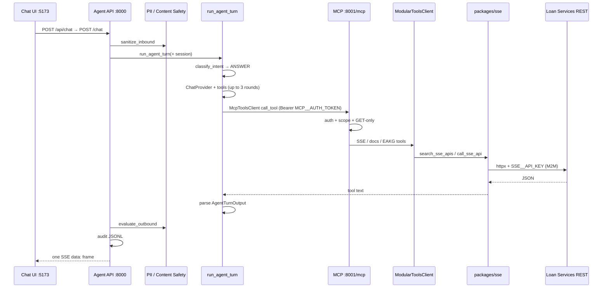
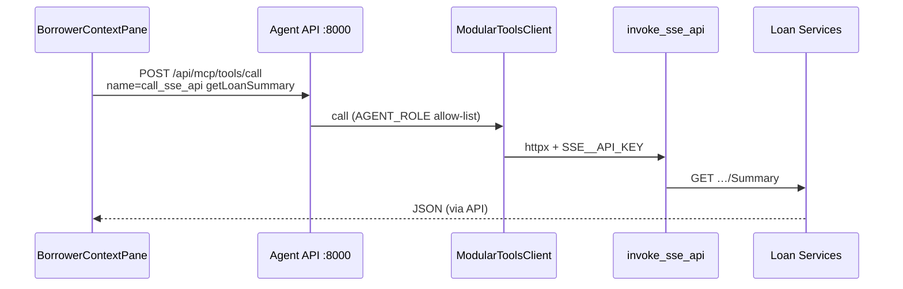
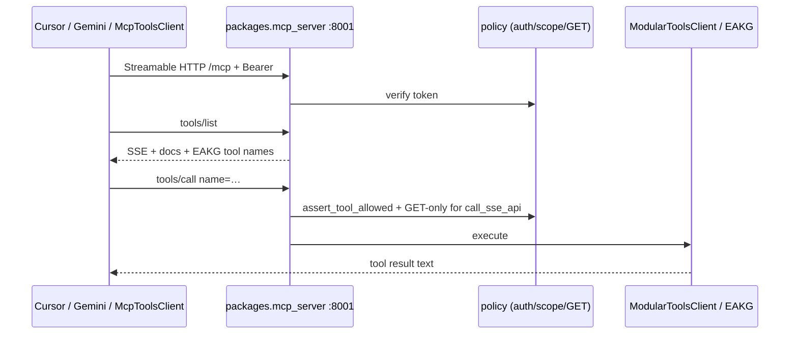
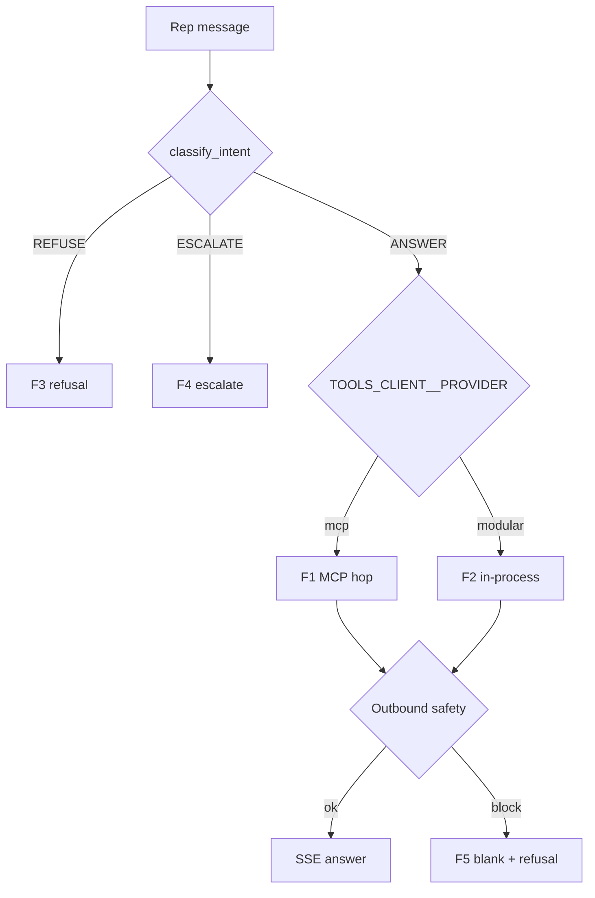
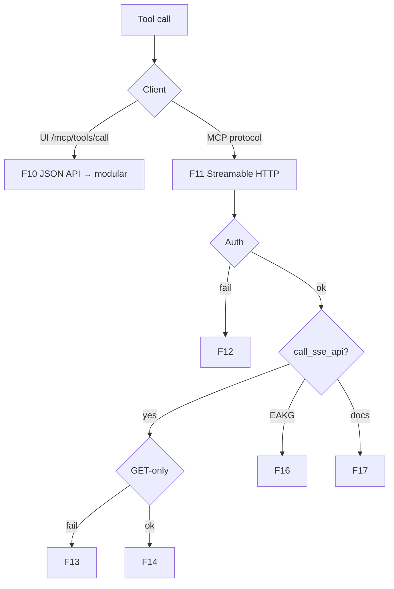

# LoanOps — Application Flows

Every runtime and ops flow for this application. Companion to [`ARCHITECTURE.md`](../ARCHITECTURE.md).  
Secrets omitted. Config = env names only.

**North star:** EAKG fills tools → MCP `:8001` → agent `/chat` + Cursor/Gemini (same endpoint).

---

## Flow index

| ID | Flow | Kind |
|---|---|---|
| F1 | Care-rep chat (product MCP hop) | Runtime |
| F2 | Care-rep chat (modular in-process) | Runtime / rollback |
| F3 | Chat intent refuse | Runtime |
| F4 | Chat intent escalate | Runtime |
| F5 | Chat outbound content-safety block | Runtime |
| F6 | Chat PII tokenize mode | Runtime |
| F7 | UI sidebar borrower lookup (no LLM) | Runtime |
| F8 | Session memory read | Runtime |
| F9 | Agent health / version | Runtime |
| F10 | Custom JSON tool API (`/mcp/tools*`) | Runtime |
| F11 | Real MCP Streamable HTTP (Cursor / Gemini / agent client) | Runtime |
| F12 | MCP auth failure | Runtime |
| F13 | MCP GET-only / body reject | Runtime |
| F14 | SSE catalog search → live invoke | Runtime |
| F15 | SSE fixture / catalog-only mode | Runtime |
| F16 | EAKG capability tools via MCP | Runtime |
| F17 | Docs search (when configured) | Runtime |
| F18 | Dev-only SQL / wiki / index_docs | Runtime (scoped) |
| F19 | Auth0 M2M → `SSE__API_KEY` refresh | Ops |
| F20 | EAKG register → onboard → cross-app | Ops |
| F21 | EAKG review → publish approved | Ops |
| F22 | EAKG sync (manual) | Ops |
| F23 | SOP / docs ingest (RAG) | Ops |
| F24 | Eval golden gate | Ops / CI |
| F25 | Demo stack start / stop | Ops |

---

## F1 — Care-rep chat (product MCP hop)

`TOOLS_CLIENT__PROVIDER=mcp`. Product path.



**Steps**

1. UI `ChatPane` POSTs `{ message, session_id, rep_id, loan_id }` to `/api/chat`.
2. Vite proxies → `POST /chat` on `:8000`.
3. Inbound PII sanitize (audit always; LLM sees tokens only if `PII__MODE=tokenize`).
4. Session load/create; history trim.
5. Intent = `ANSWER` → LLM tool loop.
6. Tools hop MCP → execute → return text to model.
7. Parse JSON output; outbound safety; audit; one SSE event to UI.

---

## F2 — Care-rep chat (modular in-process)

`TOOLS_CLIENT__PROVIDER=modular`. Same as F1 through step 5; **no MCP hop**.

```text
run_agent_turn → ModularToolsClient.call → packages/sse | packages/docs
```

Use for local single-process demo / rollback when `:8001` is down.

---

## F3 — Chat intent refuse

Before any LLM call:

```text
message → classify_intent → REFUSE
  → AgentTurnOutput.refusal set
  → no tools, no LLM
  → SSE answer / refusal to UI
```

Triggers (keyword): rate quotes, financial advice phrasing, payment/forbearance mutation, payoff quotes, etc. (`packages/agent_core/_intent_router.py`).

---

## F4 — Chat intent escalate

```text
message → classify_intent → ESCALATE
  → escalation payload
  → no tools / limited path
  → SSE to UI
```

Triggers: self-harm, threats, CFPB/attorney/complaint, bankruptcy/litigation, fraud, identity verification, etc.

---

## F5 — Chat outbound content-safety block

```text
… agent produces answer …
  → evaluate_outbound
  → UNSAFE → blank answer + refusal
  → audit still written
  → SSE error/refusal shape to UI
```

---

## F6 — Chat PII tokenize mode

`PII__MODE=tokenize`:

```text
inbound message → tokens for LLM
tool args → detokenize before SSE HTTP
recorded tool_calls → stay tokenized
outbound answer → detokenize for UI
```

Default `redact_audit_only`: LLM sees raw message; audit may redact.

---

## F7 — UI sidebar borrower lookup (no LLM)



- No intent router, no LLM, no outbound safety.
- Same Vite `/api` proxy.
- Typical ops: `getLoanSummary`, `getBorrowerSummary`.

---

## F8 — Session memory read

```text
UI → GET /api/chat/memory/{session_id}
  → GET /chat/memory/{session_id}
  → SessionStoreProvider
  → active/inactive turns + trim metadata
```

---

## F9 — Agent health / version

```text
GET /health → each provider factory health
  → 200 all ok | 503 any fail

GET /version → build/version string
```

MCP also: `GET http://127.0.0.1:8001/health` (custom route on MCP app).

---

## F10 — Custom JSON tool API (`/mcp/tools*`)

**Not** Model Context Protocol. Agent API routes in `mcp_routes.py`.

| Method | Path | Behavior |
|---|---|---|
| GET | `/mcp/tools` | List tools for `AGENT_ROLE` |
| POST | `/mcp/tools/call` | Invoke one tool in-process via `ModularToolsClient` |
| POST | `/mcp/keys` | Register API key hash in process store (scopes stored; not fully enforced on call today) |

Used by UI sidebar (F7). Distinct from F11.

---

## F11 — Real MCP Streamable HTTP

Clients: Cursor, Gemini, `McpToolsClient` (agent when provider=`mcp`).



**Config:** `MCP__HOST` / `MCP__PORT` / `MCP__PATH` / `MCP__AUTH_TOKEN` / `MCP__ROLE`.  
**Cursor:** `~/.cursor/mcp.json` → `http://127.0.0.1:8001/mcp`.

Tools (role `system`):  
`search_sse_apis`, `list_sse_apis`, `call_sse_api`, `search_docs`,  
`search_capabilities`, `explain_capability`, `find_providers`, `impact_of_change`.

---

## F12 — MCP auth failure

```text
missing / wrong Bearer
  → AuthError / connection reject
  → tools not usable
```

Empty `MCP__AUTH_TOKEN` on server → reject all.

---

## F13 — MCP GET-only / body reject

On MCP boundary only (`packages/mcp_server/policy.py`):

```text
call_sse_api + body → reject
call_sse_api + method != GET → reject
resolved operation not GET → reject
```

In-process modular path (F2/F7/F10) does **not** apply this guard today.

---

## F14 — SSE catalog search → live invoke

```text
search_sse_apis(query)
  → OpenAPI catalog keyword rank
  → (optional) EAKG capability block if CAPABILITY_KG__ENABLED

call_sse_api(operation_id, path_params)
  → find_operation
  → assert_allowed_url
  → Authorization: Bearer SSE__API_KEY (if set)
  → httpx GET/…
  → InvokeResult JSON
```

**D7:** `SSE__API_KEY` = Subservicing Auth0 M2M (audience `https://pennymac`).

---

## F15 — SSE fixture / catalog-only mode

```text
SSE__USE_FIXTURE=true
  → catalog from fixture JSON / recorded OpenAPI
  → may still call live host if invoke enabled and key set
SSE__FIXTURE_PATH=…  (catalog seed)
SSE__USE_FIXTURE=false + swagger links
  → fetch swagger with Bearer
  → live invoke
```

---

## F16 — EAKG capability tools via MCP

```text
search_capabilities / explain_capability / find_providers / impact_of_change
  → merge shards under data/eakg (or approved.ttl if APPROVED_ONLY)
  → RDFLib query
  → JSON rows + evidence
```

Requires local shards (machine-only; not all committed). Empty graph → empty/structured miss, not auth error.

---

## F17 — Docs search (when configured)

```text
search_docs(query)
  → DocsService → embedding + vector store namespace "docs"
```

If docs provider not wired → tool error `docs not configured` (F11 P5).

---

## F18 — Dev-only SQL / wiki / index_docs

Only when role includes scopes (`AGENT_ROLE=dev` etc.):

| Tool | Flow |
|---|---|
| `index_docs` | Chunk `data/sops` → upsert vector store |
| `get_customer_servicing_summary` | SQL or fixture |
| `run_read_only_sql` | SELECT-only classifier → SQL Server |
| `wiki_*` | Stubs (“not yet ported”) |

Not on default LLM tool list (`_SSE_ANSWER_TOOLS`).

---

## F19 — Auth0 M2M → `SSE__API_KEY` refresh

```text
.\scripts\auth\refresh-sse-m2m.ps1
  → read SubservicingClient user-secrets Auth0M2M:ClientSecret
  → POST auth.dev…/oauth/token (client_credentials, audience https://pennymac)
  → write SSE__API_KEY into .env
  → restart MCP / Agent to reload
```

Manual only (D10). TTL ~24h.

---

## F20 — EAKG register → onboard → cross-app

```text
python -m packages.eakg register --id … --git-url …
python -m packages.eakg onboard --id …
  → clone workspace → extract (Roslyn/auto) → shard TTL
python -m packages.eakg cross-app
  → rebuild enterprise/cross_app.ttl
python -m packages.eakg ingest-taac …   # optional
```

---

## F21 — EAKG review → publish approved

```text
python -m packages.eakg review --pilot
  → approve/reject edges → decision log
python -m packages.eakg publish
  → data/eakg/catalog/approved.ttl
```

CLI live; Web UI also in scope (D8) but not built.

---

## F22 — EAKG sync (manual)

D10: **manual only** — no Task Scheduler, no live GitLab schedule.

```text
python -m packages.eakg sync repo --id <repo>
python -m packages.eakg sync nightly
python -m packages.eakg sync audit
```

Scripts under `scripts/eakg/` / `ci/eakg.gitlab-ci.yml` = reference for later opt-in.

---

## F23 — SOP / docs ingest (RAG)

```text
uv run python -m packages.rag.ingest data/sops
  → chunk markdown → embed → vector collection "sops" / docs path
```

Offline; not on chat critical path unless `search_docs` configured.

---

## F24 — Eval golden gate

```text
uv run python -m packages.eval …  (golden.jsonl)
  → run prompts → metrics / Ragas
  → CI gate thresholds (never lower)
```

Full `/chat` eval via MCP hop needs Bedrock SSO green.

---

## F25 — Demo stack start / stop

```text
# Preferred product demo
uv run python -m packages.mcp_server          # :8001
uv run uvicorn apps.agent_api.main:app …      # :8000
cd apps/web_ui; npm run dev                   # :5173

# Note: run-demo.ps1 may still start legacy tools_api on :8001 — prefer MCP above
.\stop-demo.ps1   # free 8000/8001/5173 (fix string interpolation if needed)
```

---

## Decision branches (quick)





---

## Related

| Doc | Role |
|---|---|
| [`ARCHITECTURE.md`](../ARCHITECTURE.md) | Living architecture |
| [`docs/MCP_CLIENT_INTEGRATION.md`](MCP_CLIENT_INTEGRATION.md) | Agent as MCP consumer |
| [`docs/MCP_SECURITY.md`](MCP_SECURITY.md) | Authz controls |
| [`docs/MCP_CURSOR_VALIDATION.md`](MCP_CURSOR_VALIDATION.md) | Cursor evidence |
| [`docs/DECIDE_AND_CLEANUP.md`](DECIDE_AND_CLEANUP.md) | D7/D10 auth & schedule |
| [`docs/EAKG_INDEX_SCHEDULE.md`](EAKG_INDEX_SCHEDULE.md) | Manual sync commands |
