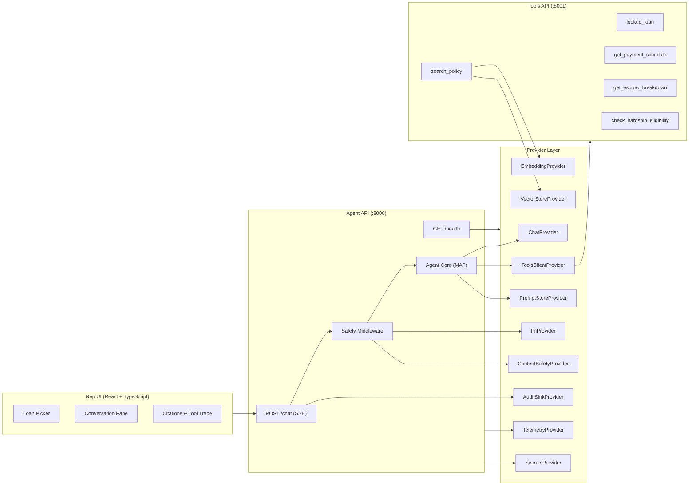

# Product Requirements Document — Servicing Agent ("Helix")

**Version:** 1.0
**Date:** 2026-05-23
**Owner:** Delivery Lead
**Status:** Draft

---

## Table of Contents

1. [Executive Summary](#1-executive-summary)
2. [Problem Statement](#2-problem-statement)
3. [Product Vision & Goals](#3-product-vision--goals)
4. [Users & Personas](#4-users--personas)
5. [Scope](#5-scope)
6. [Functional Requirements](#6-functional-requirements)
7. [Non-Functional Requirements](#7-non-functional-requirements)
8. [System Architecture](#8-system-architecture)
9. [Provider Abstraction Pattern](#9-provider-abstraction-pattern)
10. [Data Requirements](#10-data-requirements)
11. [API Contracts](#11-api-contracts)
12. [Safety & Responsible AI](#12-safety--responsible-ai)
13. [Evaluation & Quality Gates](#13-evaluation--quality-gates)
14. [Delivery Phasing & Milestones](#14-delivery-phasing--milestones)
15. [RACI Matrix](#15-raci-matrix)
16. [Risks & Mitigations](#16-risks--mitigations)
17. [Constraints & Assumptions](#17-constraints--assumptions)
18. [Glossary](#18-glossary)

---

## 1. Executive Summary

**Helix** is an internal, citation-grounded AI copilot for licensed mortgage-servicing care representatives at a Tier-1 US mortgage servicer (modelled on LoanOps Agent, $700B+ serviced). The agent retrieves the right policy, calls read-only loan APIs, and drafts a response for the rep to approve before delivery to the borrower.

The system is **hybrid by design**: an identical Python codebase runs locally (Ollama + Qdrant) or on AWS (Amazon Bedrock + Qdrant Cloud) via environment-variable swap, with no code forks. The product is explicitly **not borrower-facing** and never offers licensed advice.

---

## 2. Problem Statement

The servicer's care operations handle high volumes of inbound borrower contacts covering **payments, escrow, hardship/relief programs, payoff information, and policy questions**. Reps today rely on a patchwork of:

- Standard Operating Procedures (SOPs)
- Knowledge-base articles
- State-specific relief PDFs
- Core-system screens

This fragmented information landscape drives up **Average Handle Time (AHT)** and depresses **First-Contact Resolution (FCR)** — the two dominant operational KPIs.

**The opportunity:** An internal copilot that surfaces the right policy with citations, calls the right read-only loan API, and drafts a rep-ready response — all in a single workflow.

---

## 3. Product Vision & Goals

### Vision

> Every care rep has an always-ready, compliance-safe AI assistant that pulls the exact policy, verifies loan data, and drafts a cited answer — cutting handle time and eliminating knowledge gaps.

### Goals

| Goal | Target |
|------|--------|
| Reduce Average Handle Time (pilot vs control) | ~30% reduction |
| Lift First-Contact Resolution (pilot vs control) | +5 to +10 points |
| Ensure grounding / factual accuracy | ≥ 85% Ragas faithfulness |
| Eliminate uncited factual claims | 100% citation coverage |
| Correctly refuse out-of-scope requests | ≥ 95% refusal correctness |
| Maintain low latency | p95 ≤ 4.0 seconds |
| Control cost per query | ≤ $0.04 per resolved query |

---

## 4. Users & Personas

### 4.1 Care Representative (Tier 1/2)

- **Primary need:** Fast, citable answer to a borrower question; draft reply ready for approval
- **Frequency:** Every call
- **Context:** On the phone with a borrower, needs an answer in seconds, not minutes. Navigates multiple screens and documents today.

### 4.2 Supervisor

- **Primary need:** QA sampling, escalation review
- **Frequency:** Daily
- **Context:** Reviews a percentage of rep-approved responses for quality, tone, and compliance adherence.

### 4.3 Compliance Reviewer

- **Primary need:** Audit trail of prompts, retrieved chunks, tool calls, and outputs
- **Frequency:** Periodic / on-incident
- **Context:** Must verify that no regulated advice was given, PII was handled correctly, and escalation triggers were honored.

---

## 5. Scope

### 5.1 In Scope (v1)

| Capability | Description |
|------------|-------------|
| **Payment summary** | Due dates, late-fee lookup (read-only) |
| **Escrow breakdown** | Balance, recent disbursements, change drivers (read-only) |
| **Hardship / forbearance info** | Program information and eligibility *hints* based on documented criteria — never a binding decision |
| **Payoff explanation** | Informational explanation only (not a payoff quote) |
| **Policy / SOP search** | Citation-grounded search including state-specific relief programs (CA, FL, NY, TX, OH) |
| **Drafted rep response** | Approved-tone draft the rep reviews before delivery |
| **Escalation detection** | Automatic detection and routing of safety, regulatory, legal, fraud, and identity triggers |
| **Refusal enforcement** | Refuse out-of-scope requests (rate quotes, advice, mutating actions) |

### 5.2 Out of Scope (v1)

- Any borrower-facing channel (chat, voice, email)
- Rate quotes, APR calculation, refinancing advice
- Mutating actions (no payments posted, no plans started, no holds placed)
- Fair-lending sensitive decisioning (denial/approval language)
- Licensed legal, tax, or financial advice
- Multi-turn memory or conversation history beyond the current session

---

## 6. Functional Requirements

### FR-1: Loan Data Lookup

| ID | Requirement |
|----|-------------|
| FR-1.1 | The agent SHALL call `lookup_loan(loan_id)` to retrieve borrower context (name, state, status, balance, escrow flag, delinquency, flags) |
| FR-1.2 | The agent SHALL call `get_payment_schedule(loan_id, months)` to retrieve upcoming payment breakdowns |
| FR-1.3 | The agent SHALL call `get_escrow_breakdown(loan_id)` to retrieve escrow balance, change drivers, and disbursement history |
| FR-1.4 | The agent SHALL call `check_hardship_eligibility(loan_id, program)` to return non-binding eligibility hints with reasoning factors |
| FR-1.5 | All tool calls SHALL be read-only; no mutating actions are permitted in v1 |

### FR-2: Policy Search & Citations

| ID | Requirement |
|----|-------------|
| FR-2.1 | The agent SHALL call `search_policy(query, state, k)` for any question referencing policy, program rules, state law, or SOPs |
| FR-2.2 | Every factual claim in the response SHALL have a citation referencing either a `policy:` source or a `tool:` source |
| FR-2.3 | If no citation can be found after tool calls and policy search, the agent SHALL refuse and explain |
| FR-2.4 | Citations SHALL include chunk ID, source path, relevance score, and snippet text |

### FR-3: Response Drafting

| ID | Requirement |
|----|-------------|
| FR-3.1 | The agent SHALL produce a structured JSON response matching the `AgentTurnOutput` schema (see §11) |
| FR-3.2 | The drafted answer SHALL use professional, empathetic tone at ~8th-grade reading level |
| FR-3.3 | The answer SHALL use the borrower's first name (from `lookup_loan`) or "the borrower" as fallback |
| FR-3.4 | `requires_human_approval` SHALL always be `true` in v1 |
| FR-3.5 | The agent SHALL retry once on JSON schema failure; refuse on second failure |

### FR-4: Escalation Handling

| ID | Requirement |
|----|-------------|
| FR-4.1 | The agent SHALL detect escalation triggers and set the `escalation` field with category and reason |
| FR-4.2 | Escalation categories: `safety`, `complaint_or_regulatory`, `legal_status`, `fraud`, `identity` |
| FR-4.3 | On escalation, the agent SHALL NOT draft a reply — only populate `escalation` and `refusal` |

**Escalation triggers:**
- Self-harm, suicide, threats, domestic violence → `safety`
- CFPB, attorney, lawsuit, regulator, BBB, written complaint, QWR, NOE → `complaint_or_regulatory`
- Bankruptcy, foreclosure stop-the-clock, active litigation → `legal_status`
- Identity theft, fraud, unauthorized access → `fraud`
- Ambiguous borrower identity verification → `identity`

### FR-5: Refusal Handling

| ID | Requirement |
|----|-------------|
| FR-5.1 | If no citation is available after search: refusal = "I could not find a cited source for this. Please rephrase or provide the policy area, and I will retry." |
| FR-5.2 | If request is out-of-scope (rate quote, advice, mutating action): refusal = "This request is outside v1 scope. Route to \<queue\>." |

### FR-6: PII Handling

| ID | Requirement |
|----|-------------|
| FR-6.1 | SSN SHALL be masked as `XXX-XX-1234` in all agent outputs |
| FR-6.2 | DOB SHALL be masked as `XX/XX/YYYY` |
| FR-6.3 | Account numbers SHALL be masked as `****1234` |
| FR-6.4 | PII SHALL be redacted from prompts before they reach the LLM |
| FR-6.5 | Audit logs SHALL store only the redacted snapshot |

### FR-7: Rep UI

| ID | Requirement |
|----|-------------|
| FR-7.1 | Two-pane layout: borrower context (loan picker, last call notes mock) | conversation |
| FR-7.2 | Display drafted answer with inline citation markers |
| FR-7.3 | Citations SHALL be clickable links to source SOP documents |
| FR-7.4 | Display tool-call trace (name, args, result summary) |
| FR-7.5 | Display confidence score (0.0–1.0) |
| FR-7.6 | "Approve & copy" button for the rep to accept the draft |
| FR-7.7 | "Escalate" button to route to the appropriate queue |

### FR-8: Health & Observability

| ID | Requirement |
|----|-------------|
| FR-8.1 | `GET /health` SHALL aggregate healthcheck results from all 10 registered providers |
| FR-8.2 | If any required provider fails healthcheck, return HTTP 503 |
| FR-8.3 | `GET /version` SHALL return the current application version |
| FR-8.4 | Every provider call SHALL emit a telemetry event with provider name, operation, latency, tokens, cost, error |

---

## 7. Non-Functional Requirements

### 7.1 Performance

| Metric | Requirement |
|--------|-------------|
| End-to-end latency (p95) | ≤ 4,000 ms |
| Agent API streaming | SSE via `POST /chat` |
| Tools API response time | ≤ 200 ms per endpoint |

### 7.2 Security

| Requirement | Details |
|-------------|---------|
| No PII in code/commits | All loan data is synthetic |
| Bearer token auth | Tools API protected via `TOOLS_API_TOKEN` |
| Secrets management | `.env` (local) / AWS Secrets Manager + IAM Roles (AWS) |
| No keys in code | `.env.example` only; `.env` is gitignored |
| Content delimiters | Retrieved content is delimited; system prompt treats it as untrusted data |
| Tool allowlist | Only 5 whitelisted tools; no tool invention |

### 7.3 Reliability

| Requirement | Details |
|-------------|---------|
| Startup fail-fast | Application fails fast if required provider config is missing or healthcheck fails on boot |
| Provider health aggregation | `/health` endpoint checks all 10 providers |
| Idempotent close | Every provider's `close()` must be safely callable multiple times |

### 7.4 Maintainability

| Requirement | Details |
|-------------|---------|
| Type safety | `mypy --strict` on all packages; no `Any` without explicit `# type: ignore` |
| Linting | `ruff` for lint + format |
| Pre-commit hooks | ruff, mypy, end-of-file-fixer |
| Async throughout | Async Python for the entire backend |
| Dependency pinning | All packages pinned to exact versions in `pyproject.toml` |
| Package management | `uv` for all Python environment management |

### 7.5 Portability

| Requirement | Details |
|-------------|---------|
| Local-first | `make demo` runs with zero AWS credentials |
| Hybrid parity | Same code path runs locally and in AWS; only bound provider changes |
| Granular provider mix | e.g., cloud LLM + local vector store is a supported combination |

---

## 8. System Architecture

### 8.1 Module Layout

```
LoanOps Agent_Demos/
  apps/
    agent_api/          # FastAPI :8000 — /chat (SSE), /health, /version
    tools_api/          # FastAPI :8001 — 5 mock servicing endpoints
    web_ui/             # React + TypeScript rep UI (Vite)
  packages/
    agent_core/         # Microsoft Agent Framework agent, prompt loader, intent router
    rag/                # Chunker, ingest CLI, retrieval
    safety/             # PII redaction + content-safety middleware
    eval/               # Ragas + custom metrics, golden runner, CI gate
    common/
      settings.py       # Pydantic Settings — single source of env truth
      schemas.py        # Shared Pydantic models
      providers/        # Provider Abstraction layer (load-bearing)
  data/
    sops/               # ~30 synthetic SOPs (markdown w/ YAML frontmatter)
    loans.json          # 50 synthetic loans
    golden.jsonl        # 50 Q&A golden items
  infra/
    terraform/              # AWS IaC modules
    scripts/            # azd hooks
  docs/
    01-servicing-agent-prompts.md   # Project brief (source of truth — do not edit)
    02-architecture.md
    03-eval-strategy.md
```

### 8.2 Tech Stack

| Layer | Local (dev) | AWS (target) |
|-------|-------------|----------------|
| Language | Python 3.11 | Python 3.11 |
| API framework | FastAPI | FastAPI on ECS Fargate |
| Orchestration | Microsoft Agent Framework | Same + Prompt Flow |
| LLM | Ollama (Llama 3.1 8B) | Amazon Bedrock (GPT-4o-mini routing, GPT-4o complex) |
| Embeddings | bge-small-en-v1.5 (local) | text-embedding-3-large (Bedrock) |
| Vector store | Qdrant (Docker) | Qdrant Cloud (BM25 + vector + semantic re-rank) |
| PII | Presidio (en) | Presidio (same — runs on-host) |
| Content safety | Rule-based stub | AWS AI Content Safety |
| Audit log | JSONL on disk | CloudWatch Logs custom events + ADLS append |
| Observability | OpenTelemetry → console | CloudWatch Logs + CloudWatch Logs |
| Secrets | `.env` | AWS Secrets Manager + IAM Roles |
| UI | React + TypeScript (Vite) | Static Web Apps |
| CI/CD | GitHub Actions (lint, test, eval-gate) | + `azd up` / Terraform deploy |
| IaC | n/a | Terraform modules |

### 8.3 Architecture Diagram



---

## 9. Provider Abstraction Pattern

> **This is the load-bearing wall of the architecture.** Every external capability is consumed through a Provider — an interface (`typing.Protocol`) plus concrete implementations selected at runtime via environment variables. No application code may import a concrete provider directly.

### 9.1 Provider Catalogue

| # | Provider | Protocol | Local Implementation | AWS Implementation | Env Var |
|---|----------|----------|---------------------|---------------------|---------|
| 1 | LLM (chat) | `ChatProvider` | `OllamaChatProvider` | `AWSOpenAIChatProvider` | `LLM__PROVIDER` |
| 2 | Embeddings | `EmbeddingProvider` | `LocalBgeEmbeddingProvider` | `AWSOpenAIEmbeddingProvider` | `EMBEDDING__PROVIDER` |
| 3 | Vector store | `VectorStoreProvider` | `QdrantVectorStoreProvider` | `AWSAISearchVectorStoreProvider` | `VECTOR_STORE__PROVIDER` |
| 4 | PII detection | `PiiProvider` | `PresidioPiiProvider` | `PresidioPiiProvider` (same) | `PII__PROVIDER` |
| 5 | Content safety | `ContentSafetyProvider` | `RuleBasedSafetyProvider` | `AWSContentSafetyProvider` | `SAFETY__PROVIDER` |
| 6 | Audit sink | `AuditSinkProvider` | `JsonlAuditSinkProvider` | `AppInsightsAuditSinkProvider` | `AUDIT__SINK` |
| 7 | Secrets | `SecretsProvider` | `EnvFileSecretsProvider` | `KeyVaultSecretsProvider` | `SECRETS__PROVIDER` |
| 8 | Telemetry | `TelemetryProvider` | `ConsoleOtelTelemetryProvider` | `AppInsightsTelemetryProvider` | `TELEMETRY__PROVIDER` |
| 9 | Tools client | `ToolsClientProvider` | `HttpToolsClientProvider` | `HttpToolsClientProvider` (mTLS) | `TOOLS_CLIENT__PROVIDER` |
| 10 | Prompt store | `PromptStoreProvider` | `FilePromptStoreProvider` | `PromptFlowPromptStoreProvider` | `PROMPT_STORE__PROVIDER` |

### 9.2 Pattern Rules

1. **Contract first.** Each Protocol is defined before any concrete class, in `packages/common/providers/<name>.py`.
2. **No direct imports.** Consumers access providers only via `get_<x>_provider()` factories in `factory.py`.
3. **One factory per provider.** Factories read a single `Settings` object — never `os.environ` directly.
4. **Lifecycle methods.** Every provider exposes `async healthcheck() -> ProviderHealth` and `async close() -> None`.
5. **Structured config.** Provider-specific config is a Pydantic model nested under `Settings`. Unknown keys are rejected. Missing required keys fail fast at startup.
6. **Determinism flag.** Every provider supports `deterministic: bool` for eval and CI.
7. **Telemetry hooks.** Every provider call emits a structured event with `provider_name`, `operation`, `latency_ms`, `tokens_in/out`, `usd_cost`.
8. **Testing contract.** Every Protocol has an `InMemory<X>Provider` and a `contract_test_<x>.py` that all concrete impls must pass.
9. **No fan-out.** Different quality tiers (e.g., fast vs accurate LLM) are parameterised, not duplicated.
10. **Backwards-compatible only.** Breaking changes require `<X>ProviderV2` and a deprecation window.

### 9.3 CI Enforcement

A CI grep gate ensures:
- No concrete provider imports outside `packages/common/providers/`
- No `os.environ` / `os.getenv` outside `packages/common/settings.py`

---

## 10. Data Requirements

### 10.1 Synthetic Loans (`data/loans.json`)

- 50 synthetic loans
- State mix: CA, TX, FL, NY, OH
- Fields: `id`, `borrower_name`, `state`, `status`, `balance`, `escrowed`, `last_payment_date`, `hardship_history`
- **No real PII** — all data is synthetic

### 10.2 Synthetic SOPs (`data/sops/`)

- ~30 markdown files
- Categories: payments, escrow, hardship/forbearance, loss-mitigation, payoff info, complaint handling, state-specific relief (CA/FL/NY minimum)
- Each file has YAML frontmatter: `id`, `category`, `state`, `version`

### 10.3 Golden Q&A Set (`data/golden.jsonl`)

- 50 items for evaluation
- Distribution: ~70% happy path, ~10% refusal, ~20% escalation
- Spread across CA/TX/FL/NY/OH
- Minimum: 5 refusal cases, 5 escalation cases
- Schema per item:

```json
{
  "id": "g001",
  "rep_prompt": "...",
  "loan_id": "100245",
  "expected": {
    "refusal": false,
    "escalation": null,
    "must_cite": ["policy:escrow/annual-analysis.md"],
    "must_call_tools": ["get_escrow_breakdown"],
    "forbidden_phrases": ["refinance", "guarantee"]
  }
}
```

### 10.4 RAG Pipeline

- **Chunker:** ~600 tokens, 80-token overlap, markdown header-aware
- **Ingest CLI:** `python -m packages.rag.ingest data/sops`
- **Retrieval:** Top-k nearest-neighbour via vector store provider

---

## 11. API Contracts

### 11.1 Agent API (`apps/agent_api` — port 8000)

| Endpoint | Method | Description |
|----------|--------|-------------|
| `/chat` | POST | Streaming SSE — accepts rep prompt, returns `AgentTurnOutput` |
| `/health` | GET | Aggregated provider health (10 providers); 503 on failure |
| `/version` | GET | Application version |

### 11.2 Tools API (`apps/tools_api` — port 8001)

| Endpoint | Method | Auth | Description |
|----------|--------|------|-------------|
| `/lookup_loan` | GET | Bearer | Loan summary |
| `/get_payment_schedule` | GET | Bearer | Next N payment breakdowns |
| `/get_escrow_breakdown` | GET | Bearer | Escrow balance, drivers, disbursements |
| `/check_hardship_eligibility` | GET | Bearer | Non-binding eligibility hint |
| `/search_policy` | POST | Bearer | RAG-powered policy search |

### 11.3 Agent Output Schema (`AgentTurnOutput`)

```json
{
  "answer": "<rep-facing draft reply with [n] citation markers>",
  "citations": [
    {"id": 1, "source": "policy:...", "snippet": "..."},
    {"id": 2, "source": "tool:...", "snippet": "..."}
  ],
  "tool_calls": [
    {"name": "lookup_loan", "args": {"loan_id": "..."}, "result_summary": "..."}
  ],
  "requires_human_approval": true,
  "confidence": 0.92,
  "refusal": null,
  "escalation": null
}
```

- `requires_human_approval`: always `true` in v1
- `confidence`: 0.0–1.0 (model self-rated grounding strength)
- `refusal`: string or null
- `escalation`: `{category, reason}` or null
- Allowed tool names: `lookup_loan`, `get_payment_schedule`, `get_escrow_breakdown`, `check_hardship_eligibility`, `search_policy`
- Escalation categories: `safety`, `complaint_or_regulatory`, `legal_status`, `fraud`, `identity`

### 11.4 Audit Record Schema

Per turn:
- `turn_id`, `rep_id`
- `prompt_redacted` (PII-stripped)
- `retrieved_chunk_ids`
- `tool_calls` (name, args, result summary)
- `raw_model_output`
- `final_output` (after safety filtering)
- `latency_ms`, `cost_usd`
- `providers_bound` (snapshot of which provider answered each capability)

---

## 12. Safety & Responsible AI

### 12.1 Grounding Rule

No answer without at least one citation. The agent refuses otherwise.

### 12.2 Human-in-the-Loop (HITL)

Every drafted reply requires rep approval before borrower delivery. No tool in v1 mutates state.

### 12.3 PII Redaction at Ingress

- Presidio analyzer + anonymizer at the middleware layer
- SSN, DOB, account numbers, full names redacted from prompts before they reach the LLM
- Full values stay in the tools layer only

### 12.4 Content Safety at Egress

- **Local:** Rule-based stub (block list + regex)
- **AWS:** AWS AI Content Safety
- Categories: `hate`, `selfHarm`, `sexual`, `violence`, plus jailbreak detection

### 12.5 Audit Trail

Append-only audit log per turn capturing the full chain: redacted prompt → retrieved chunks → tool calls → raw model output → final approved output → rep ID → latency → cost.

### 12.6 Prompt-Injection Hardening

- Tool calls confined to a strict 5-tool allowlist
- Retrieved content is delimited in the prompt
- System prompt instructs the model to treat retrieved text as untrusted data, not instructions

### 12.7 Disclaimers

Drafted reply templates include standard servicing disclaimers where required by policy.

### 12.8 Supervisor Oversight

Mandatory supervisor sampling on 10% of rep-approved replies.

---

## 13. Evaluation & Quality Gates

### 13.1 Metrics & Thresholds

| Metric | Threshold | Source |
|--------|-----------|--------|
| Faithfulness (Ragas) | ≥ 0.85 | Eval gate, nightly + PR |
| Citation coverage | = 1.0 (100% of non-refusal answers) | Custom metric |
| Refusal correctness (TP rate) | ≥ 0.95 | Golden set |
| p95 end-to-end latency | ≤ 4,000 ms | CloudWatch Logs |
| Cost per resolved query | ≤ $0.04 | Token accounting |

### 13.2 Eval Harness

- **Runner:** `python -m packages.eval.run --golden data/golden.jsonl --report out/eval.json`
- **Golden set:** 50 items (70% happy path, 10% refusal, 20% escalation)
- **CI integration:** Build fails on any threshold breach
- **`make eval`** produces `out/eval.json` and exits non-zero on regression

### 13.3 Sacred Rule

> **Never weaken or remove the eval gate.** If a threshold is failing, fix the root cause, not the threshold. If the threshold is genuinely wrong, escalate and get explicit approval before changing it.

### 13.4 CI Workflows

| Workflow | Trigger | Actions |
|----------|---------|---------|
| `ci.yml` | PR | Lint (ruff) + type check (mypy --strict) + unit tests |
| `eval-gate.yml` | PR + nightly on main | Run eval harness; upload `out/eval.json` artifact; comment summary on PR; fail on threshold breach |

---

## 14. Delivery Phasing & Milestones

### Phase Overview

| Phase | Weeks | Goal | Exit Criteria |
|-------|-------|------|---------------|
| **POC** | 1–4 | Working agent on synthetic data, local-first | 50-item golden set passes thresholds; end-to-end demo; SDD signed |
| **Pilot** | 5–8 | Cloud deployment, 5 reps shadow use | 100+ shadow hours; no high-sev compliance findings; AHT trend established; canary deploy proven |
| **Prod** | 9–12 | Full pod rollout, monitoring, runbooks | SRE on-call ready; drift alerts active; A/B vs control running; managed-services handoff complete |

### Build Steps (POC Phase)

| Step | Name | Acceptance Criteria |
|------|------|---------------------|
| 1 | Repo skeleton | `make install lint test` exits 0 on clean clone |
| 1.5 | Provider contracts | `mypy --strict packages/common` clean; contract tests green; CI grep gate passes |
| 2 | Synthetic data | `python -m packages.eval.validate_data` reports 0 errors |
| 3 | RAG pipeline | Nearest-neighbour returns correct chunk for 10 known queries |
| 4 | Tools API | `pytest apps/tools_api/tests` green; OpenAPI at `/docs` |
| 5 | Agent core | Unit tests cover happy/refuse/escalate against InMemory providers |
| 6 | Agent API | 5 sample prompts return valid JSON; `/health` lists 10 providers |
| 7 | Safety layer | SSN/DOB/account redaction verified; harmful content blocked |
| 8 | Eval harness | `make eval` produces report and exits non-zero on seeded regression |
| 9 | React + TypeScript rep UI | `make demo` brings up full stack end-to-end |
| 10 | IaC + CI | Both GitHub Actions workflows green on sample PR |

---

## 15. RACI Matrix

| Activity | Delivery Lead | AI Eng | API Dev | Cloud/DevOps | QA | Compliance |
|----------|:---:|:---:|:---:|:---:|:---:|:---:|
| Architecture & SDD | A/R | C | C | C | I | C |
| Agent + RAG implementation | A | R | C | I | C | I |
| Tools API & integrations | A | C | R | C | C | I |
| IaC, CI/CD, endpoints | A | I | C | R | I | I |
| Eval harness & golden set | A | C | I | I | R | C |
| Threat model & RAI checklist | A | C | I | C | I | R |
| Pilot rollout & training | R | C | C | C | C | C |

**A** = Accountable · **R** = Responsible · **C** = Consulted · **I** = Informed

---

## 16. Risks & Mitigations

| # | Risk | Severity | Mitigation |
|---|------|----------|------------|
| 1 | **Hallucination / ungrounded answer** | High | Hard citation requirement; refuse-on-no-citation; Ragas groundedness gate in CI |
| 2 | **Prompt injection via SOP content** | High | System-prompt hardening; retrieved-content delimiters; strict tool allowlist; no eval of retrieved code |
| 3 | **PII leakage into LLM context or audit** | High | Presidio at ingress; tools never echo full PII to model; audit log stores redacted snapshot |
| 4 | **Retrieval drift after SOP updates** | Medium | Nightly eval against golden set; regression alert; re-embed pipeline on SOP change |
| 5 | **Over-reliance by reps** | Medium | Mandatory HITL; supervisor sampling on 10% of approved replies; in-app confidence display |
| 6 | **Cost blow-up under load** | Medium | Router (cheap model first, escalate on low confidence); cached embeddings; per-tenant token budget |
| 7 | **Regulatory exposure from drafted replies** | High | Out-of-scope list enforced in system prompt; legal-approved disclaimer templates; compliance review of golden set |

---

## 17. Constraints & Assumptions

### 17.1 Hard Constraints

- **Local-first:** `make demo` must work with zero AWS credentials
- **No concrete imports** outside `packages/common/providers/` — CI grep gate enforces this
- **No `os.environ` / `os.getenv`** outside `packages/common/settings.py`
- **No PII** anywhere in code, test fixtures, or commits
- **No mutating tool calls** in v1
- **Eval gate is sacred:** never lower a threshold; fix the cause
- **Every factual answer must have a citation** (policy: or tool: prefix)
- **uv** for all Python env management
- **Async Python** throughout the backend
- **mypy --strict** on all packages
- **All dependencies pinned** to exact versions

### 17.2 Key Architecture Decisions (ADRs)

| ADR | Decision | Status |
|-----|----------|--------|
| ADR-001 | Microsoft Agent Framework for orchestration | Accepted |
| ADR-002 | Ollama + Llama 3.1 8B for local dev | Accepted |
| ADR-003 | Streamlit for rep UI | Superseded by ADR-006 |
| ADR-004 | Provider Abstraction Pattern (10 Protocol interfaces) | Accepted — load-bearing |
| ADR-006 | React + TypeScript with Vite for rep UI | Accepted |

### 17.3 Assumptions

- Reps have existing borrower identity verification before engaging the copilot
- SOPs are maintained and updated by the servicer's operations team
- Synthetic data is representative enough for POC evaluation
- Ollama + Llama 3.1 8B produces acceptable (though lower-quality) outputs for local dev
- Microsoft Agent Framework supports the required tool-call and streaming patterns

---

## 18. Glossary

| Term | Definition |
|------|------------|
| **AHT** | Average Handle Time — mean duration of a borrower interaction |
| **Bedrock** | Amazon Bedrock Service |
| **Citation** | A reference to a source (policy chunk or tool output) backing a factual claim |
| **FCR** | First-Contact Resolution — percentage of inquiries resolved on the first interaction |
| **Golden set** | Curated Q&A pairs used for automated evaluation |
| **HITL** | Human-in-the-Loop — mandatory rep approval before responses reach borrowers |
| **MAF** | Microsoft Agent Framework — the agent orchestration library |
| **Provider** | A `typing.Protocol` interface + concrete implementations + factory function for an external capability |
| **RAG** | Retrieval-Augmented Generation — enriching LLM prompts with retrieved policy/SOP content |
| **Rep** | Licensed mortgage-servicing care representative |
| **SOP** | Standard Operating Procedure |
| **SSE** | Server-Sent Events — streaming protocol used by the `/chat` endpoint |

---

*This PRD is derived from [01-servicing-agent-prompts.md](file:///d:/Programming-Projects/LoanOps Agent_Demos/docs/01-servicing-agent-prompts.md), [AGENTS.md](file:///d:/Programming-Projects/LoanOps Agent_Demos/AGENTS.md), [TASKS.md](file:///d:/Programming-Projects/LoanOps Agent_Demos/TASKS.md), and [decisions.md](file:///d:/Programming-Projects/LoanOps Agent_Demos/decisions.md).*
