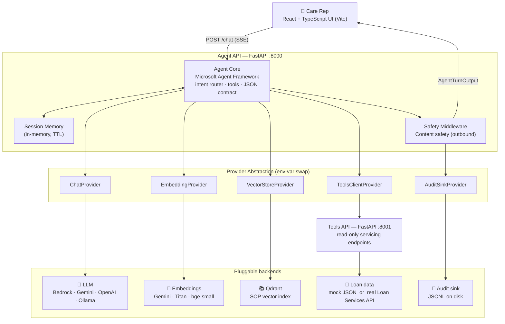
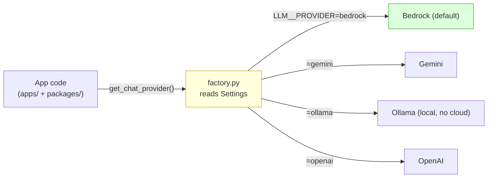
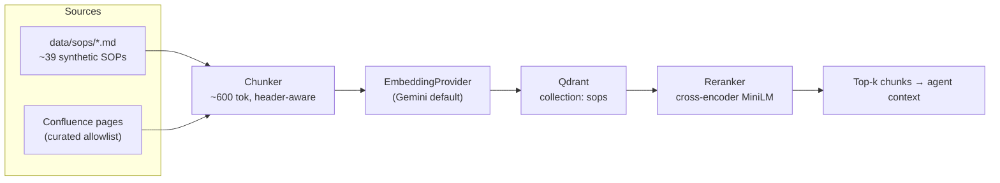
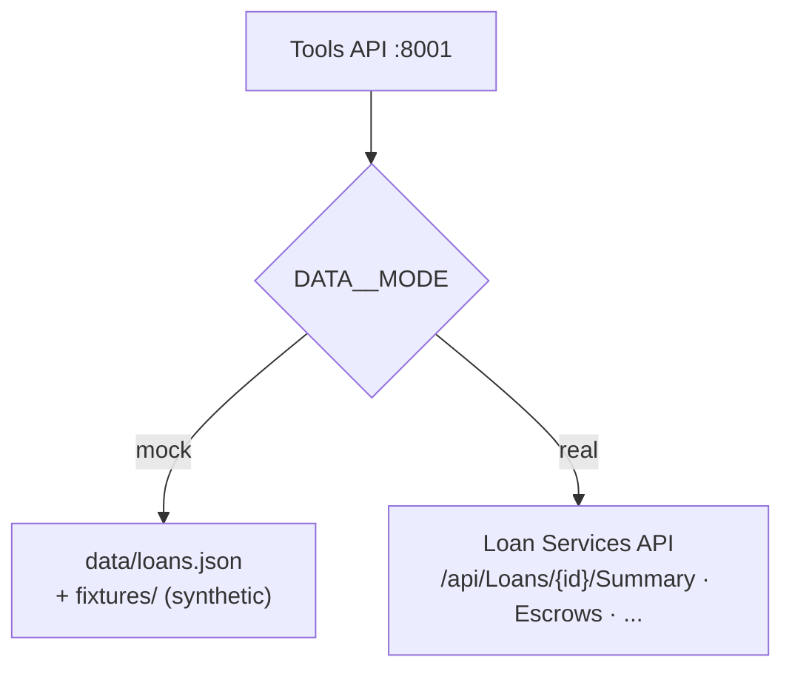

# LoanOps Agent — Demo Architecture

> One-page, demo-ready architecture. Diagrams reflect the **current** stack
> (Bedrock / Gemini / Qdrant, mock-or-real Loan API, Confluence + SOP ingest).
> For the full living spec see [`../../ARCHITECTURE.md`](../../ARCHITECTURE.md).
>
> **How to present:** each section has a diagram + a short **Say this** talk
> track. Diagrams render in any Mermaid viewer (GitHub, VS Code, Slidev).

---

## 1. The 30-second pitch

An **internal copilot for licensed mortgage-servicing care reps**. The rep asks
a question in plain English; the agent retrieves the relevant policy/SOP, pulls
live loan data, drafts a **citation-grounded** reply, and hands it back for
human approval — with content-safety guardrails on every turn.

**Say this:** *"Reps spend ~40% of their time hunting through SOPs. This agent
knows the policy, applies the logic, cites its sources, and never acts without a
human clicking approve."*

---

## 2. System at a glance (C4 container view)



**Say this:** *"Two FastAPI services. The Agent API on 8000 orchestrates the
turn; the Tools API on 8001 is the only thing that touches loan data, and it's
strictly read-only. Everything external — the LLM, embeddings, vector store,
loan data, audit — goes through a Provider interface, so we swap backends with
an env var, not a code change. A content-safety check runs on the way out."*

---

## 3. Request flow (one turn)

```mermaid
sequenceDiagram
    participant Rep as Rep (UI)
    participant API as Agent API :8000
    participant Safety as Safety Middleware
    participant Agent as Agent Core
    participant RAG as Vector + Embedding
    participant Tools as Tools API :8001
    participant LLM as ChatProvider
    participant Audit as Audit Sink

    Rep->>API: POST /chat { loan_id, message }
    API->>Agent: prompt + history
    Agent->>RAG: search_policy(query, state, k)
    RAG-->>Agent: top-k policy chunks
    Agent->>Tools: lookup_loan / escrow / schedule
    Tools-->>Agent: loan facts (read-only)
    Agent->>LLM: chat(prompt + chunks + tool results)
    LLM-->>Agent: draft (JSON contract)
    Agent->>Agent: parse + validate; retry once
    Agent->>Safety: content-safety check (outbound)
    Safety->>Audit: write audit record
    Safety-->>API: final AgentTurnOutput
    API-->>Rep: SSE stream → rep reviews → Approve / Escalate
```

**Say this:** *"Watch the guardrails wrap the turn: the answer is grounded in
retrieved chunks plus live loan facts, output is validated against a strict JSON
contract, content-safety runs on the way out, and every turn is written to an
audit log. The rep always approves before anything leaves."*

---

## 4. The load-bearing idea: Provider Abstraction



Same pattern for every external capability: chat, embedding, vector store,
content safety, audit sink, secrets, telemetry, tools client, prompt store.

| Rule | Why it matters for the demo |
|------|-----------------------------|
| No concrete imports outside `providers/` | CI grep-gate enforced; keeps the swap clean |
| One factory per capability, reads `Settings` only | Config lives in one place (`.env`) |
| Local-first | `ollama` + embedded `qdrant` → runs with **zero cloud creds** |

**Say this:** *"This is the one architectural bet that makes everything else
possible. No application file ever imports a concrete vendor class — it asks a
factory. Flip `LLM__PROVIDER` from bedrock to ollama and the whole thing runs
offline on a laptop for a demo, then swaps to cloud for prod. Same code."*

---

## 5. Knowledge pipeline (RAG ingest)



**Say this:** *"Policy content comes from synthetic SOP markdown and, optionally,
curated Confluence pages. We chunk header-aware, embed, store in Qdrant, and
rerank at query time so the top hits are actually relevant. Every fact the agent
states maps back to one of these chunks as a `policy:` citation."*

---

## 6. Data modes — mock vs real



**Say this:** *"For the demo everything is synthetic — `mock` mode reads local
JSON, no real borrower data ever touches the machine. Flip `DATA__MODE` to
`real` and the same tool endpoints call the upstream Loan Services API. The
agent code doesn't know or care which."*

---

## 7. Responsible-AI controls (the compliance story)

| Control | Mechanism | Where |
|---------|-----------|-------|
| Grounding | Hard citation requirement; refuse if no citation | Agent Core |
| Human-in-the-loop | `requires_human_approval = true` always | Output contract |
| Safety at egress | Content-safety check blocks unsafe output | Safety middleware |
| Full audit trail | Prompt, chunk IDs, tool calls, output, latency | Audit sink |
| No mutating actions | All tools read-only in v1 | Tools API |

**Say this:** *"For a regulated servicer, the guardrails are the product. Nothing
is unsourced, nothing is auto-sent, and every turn is auditable. It drafts and
cites — a licensed human decides."*

---

## 8. Live demo runbook

```powershell
# 1. Start the stack (local, zero cloud creds)
make demo            # Agent API :8000 + Tools API :8001 + UI :5173

# 2. Health check — proves every provider is wired
curl http://localhost:8000/health

# 3. In the UI, load a synthetic loan, then ask:
#    "Can we waive the late fee on this loan?"
#    → watch: RAG citation → tool lookup → approve
```

**Demo beats to hit, in order:**
1. Ask a policy question → point at the **`policy:` citation** in the answer.
2. Ask something needing loan data → point at the **`tool:` citation**.
3. Ask something unsafe / out-of-scope → show the **refusal / escalation**.
4. Open the **audit log** entry for the turn → show the full trail.
5. (Optional) Change `LLM__PROVIDER` in `.env`, restart → **same behavior, different backend**.

---

## Cross-references

| Doc | Purpose |
|-----|---------|
| [`../../ARCHITECTURE.md`](../../ARCHITECTURE.md) | Full living architecture spec |
| [`slides.md`](slides.md) | Slidev pitch deck |
| [`../../AGENTS.md`](../../AGENTS.md) | Constraints & rules |
| [`../../decisions.md`](../../decisions.md) | ADRs |
