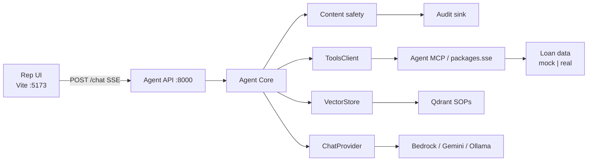
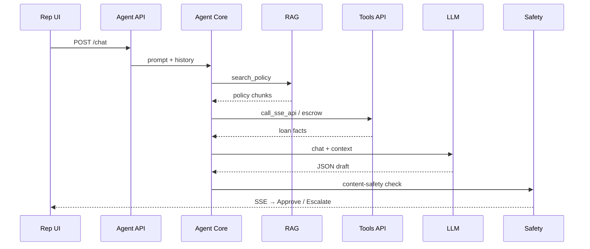
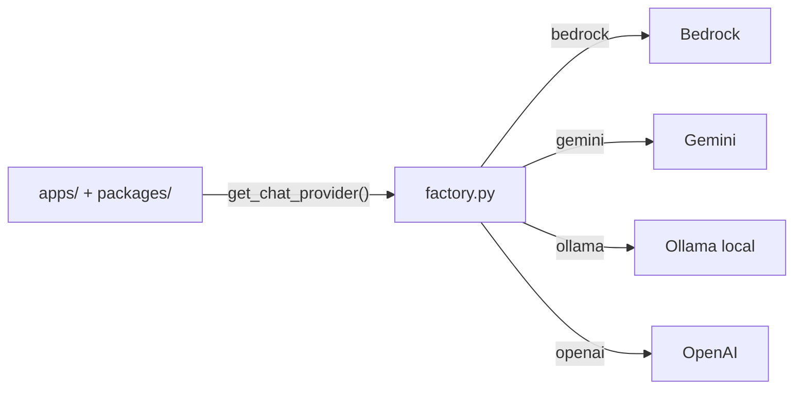
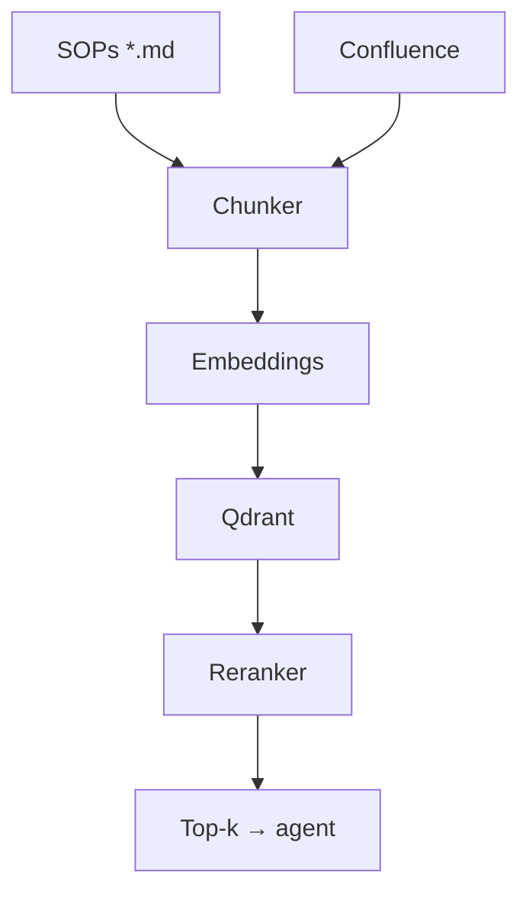
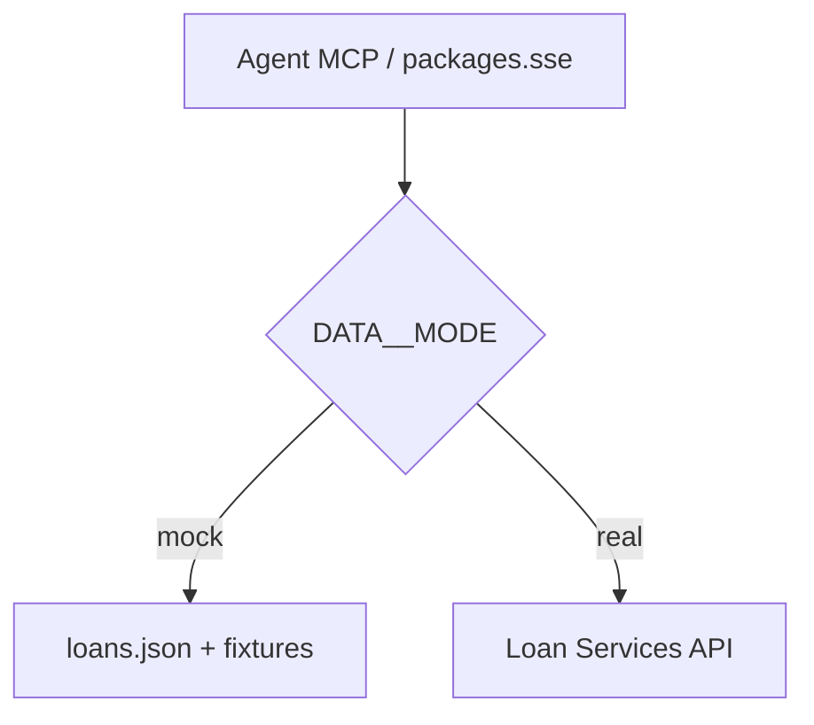

# LoanOps Agent

Internal AI platform — APIs, docs, grounded answers for any role

<div class="pt-10 text-lg opacity-80">
  Policy-grounded · Tool-aware · Human-approved
</div>

<div class="pt-12">
  <span @click="$slidev.nav.next" class="px-3 py-1 rounded cursor-pointer border border-gray-400 border-opacity-30" hover="bg-white bg-opacity-10">
    Space → next <carbon:arrow-right class="inline"/>
  </span>
</div>

<!--
30-sec open: Reps burn time hunting SOPs. Agent knows policy, cites sources, never acts without human approve.
-->

---
layout: center
---

## Agenda

| # | Topic |
|---|--------|
| 1 | Problem → solution |
| 2 | System architecture |
| 3 | One-turn request flow |
| 4 | Provider abstraction |
| 5 | RAG + loan data |
| 6 | Guardrails + eval |
| 7 | Live demo |

---
layout: two-cols
---

## The Problem

Care reps spend **~40%** of time hunting SOPs and policy docs.

<v-clicks>

- Many systems to cross-reference
- Weak context across conversations
- Inconsistent policy application
- Compliance risk when answers lack citations

</v-clicks>

::right::

<div class="flex flex-col justify-center h-full gap-4 pl-4 text-left text-sm opacity-90">

**Today**

```
Rep → portal → SOP wiki → loan system → guess
```

**Cost**

- Slow handle time
- Uneven answers
- Hard to audit

</div>

---
layout: center
class: text-center
---

## The Solution

Ask in plain English → get a **citation-grounded draft** → rep approves.

<div class="grid grid-cols-3 gap-4 mt-10 text-left">
  <div class="p-4 border border-gray-400 border-opacity-30 rounded-lg" v-click>
    <div class="font-bold mb-1">RAG-powered</div>
    <div class="text-sm opacity-75">SOPs + Confluence chunks with <code>policy:</code> citations</div>
  </div>
  <div class="p-4 border border-gray-400 border-opacity-30 rounded-lg" v-click>
    <div class="font-bold mb-1">Tool-aware</div>
    <div class="text-sm opacity-75">Read-only loan / escrow / schedule lookups</div>
  </div>
  <div class="p-4 border border-gray-400 border-opacity-30 rounded-lg" v-click>
    <div class="font-bold mb-1">Human-in-the-loop</div>
    <div class="text-sm opacity-75">Draft only — licensed rep decides</div>
  </div>
</div>

<!--
Never auto-send. Agent drafts + cites. Human clicks Approve or Escalate.
-->

---
layout: default
---

## System at a glance

Two FastAPI services. Everything external goes through **providers**.



<!--
Say: Agent API orchestrates. Tools API is only thing that touches loan data — read-only. Env-var swap for backends.
-->

---
layout: default
---

## One turn — request flow



<!--
Point at: grounding → tools → JSON contract → safety egress → human approve.
-->

---
layout: default
---

## Provider abstraction

**Load-bearing rule:** app code never imports a concrete vendor class.



<div class="mt-4 text-sm grid grid-cols-3 gap-3 text-left">
  <div class="p-3 border border-gray-400 border-opacity-30 rounded">
    <div class="font-bold">One factory</div>
    <div class="opacity-75">Reads Settings only</div>
  </div>
  <div class="p-3 border border-gray-400 border-opacity-30 rounded">
    <div class="font-bold">CI grep gate</div>
    <div class="opacity-75">No concrete imports</div>
  </div>
  <div class="p-3 border border-gray-400 border-opacity-30 rounded">
    <div class="font-bold">Local-first</div>
    <div class="opacity-75">Zero cloud creds OK</div>
  </div>
</div>

<!--
Flip LLM__PROVIDER=ollama → same code runs offline. Flip back → cloud. Same codebase.
-->

---
layout: two-cols
---

## Knowledge pipeline (RAG)



::right::

<div class="text-left pl-2">

**Sources**
- ~39 synthetic SOPs
- Curated Confluence pages

**At query time**
- Embed question
- Retrieve top-k
- Cross-encoder rerank

**Output rule**
- Every fact needs `policy:` citation
- No citation → refuse

</div>

---
layout: two-cols
---

## Loan data — mock vs real



::right::

<div class="text-left pl-2">

**Demo mode = mock**
- Synthetic loans only
- No real borrower traffic

**Same tool surface**
- `call_sse_api`
- `get_escrow_breakdown`
- `get_payment_schedule`
- `check_hardship_eligibility`

Agent code never cares which mode.

</div>

---
layout: default
---

## Guardrails (compliance story)

| Control | Mechanism |
|---------|-----------|
| Grounding | Hard citation rule — refuse if unsourced |
| Human-in-the-loop | Always requires rep approval |
| Safety at egress | Content-safety blocks unsafe drafts |
| Audit trail | Prompt, chunks, tools, output, latency |
| Read-only tools | No payments / plans / holds in v1 |

<div class="mt-6 text-center text-lg opacity-90" v-click>
  Guardrails are the product. Agent drafts. Human decides.
</div>

<!--
Skip inbound PII story for this audience. Focus content-safety + citations + HITL.
-->

---
layout: default
---

## Eval gate is sacred

Never lower a threshold. Fix the cause.

| Metric | Threshold |
|--------|-----------|
| Faithfulness (Ragas) | ≥ 0.85 |
| Citation coverage | = 1.0 |
| Refusal correctness | ≥ 0.95 |
| p95 latency | ≤ 4s |

<div class="mt-6 text-sm opacity-80">
  Golden set: <code>data/golden.jsonl</code> · CI fails on breach · artifact: <code>out/eval.json</code>
</div>

---
layout: center
class: text-center
---

## Live demo — what to watch

```text
"Can we waive the late fee on this loan?"
```

<div class="grid grid-cols-2 gap-4 mt-8 text-left text-sm">
  <div class="p-4 border border-gray-400 border-opacity-30 rounded" v-click>
    <div class="font-bold">1. Policy question</div>
    Point at <code class="text-green-500">policy:</code> citation
  </div>
  <div class="p-4 border border-gray-400 border-opacity-30 rounded" v-click>
    <div class="font-bold">2. Loan fact</div>
    Point at <code class="text-green-500">tool:</code> citation
  </div>
  <div class="p-4 border border-gray-400 border-opacity-30 rounded" v-click>
    <div class="font-bold">3. Out of scope</div>
    Show refusal / escalate
  </div>
  <div class="p-4 border border-gray-400 border-opacity-30 rounded" v-click>
    <div class="font-bold">4. Audit trail</div>
    Open turn record
  </div>
</div>

---
layout: default
---

## Start the stack

```powershell
make demo
# UI :5173 · Agent :8000 (SSE tools in-process)

curl http://localhost:8000/health
```

Optional flex: flip `LLM__PROVIDER` in `.env` → restart → **same behavior, different backend**.

---
layout: center
class: text-center
---

# Thank you

**Built for care reps.** Drafts cite. Humans approve.

<div class="pt-8 opacity-80 text-sm">
  Architecture notes → <code>presentations/demo-pitch/architecture.md</code>
</div>
