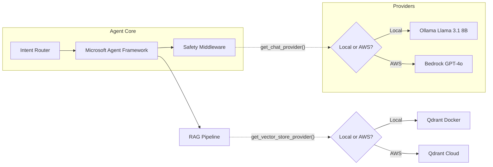

# LoanOps Agent

Internal AI Copilot for Mortgage Servicing

<div class="pt-12">
  <span @click="$slidev.nav.next" class="px-2 py-1 rounded cursor-pointer" hover="bg-white bg-opacity-10">
    Press Space for next page <carbon:arrow-right class="inline"/>
  </span>
</div>

<div class="abs-br m-6 flex gap-2">
  <button @click="$slidev.nav.openInEditor()" title="Open in Editor" class="text-xl slidev-icon-btn opacity-50 !border-none !hover:text-white">
    <carbon:edit />
  </button>
  <a href="https://github.com/mohit-bohra-dev/LoanOps-Agent" target="_blank" alt="GitHub" title="Open in GitHub"
    class="text-xl slidev-icon-btn opacity-50 !border-none !hover:text-white">
    <carbon-logo-github />
  </a>
</div>

<!--
Welcome to the LoanOps Agent pitch deck!
This is the speaker notes section. You can press `p` on the presentation to view these.
-->

---
layout: two-cols
---

## The Problem

Care reps spend **40%** of their time searching SOPs and policy documents.

<v-clicks>

- **Multiple systems** to cross-reference
- **No contextual awareness** across conversations
- **Inconsistent** policy citation and application
- **High risk** of compliance errors

</v-clicks>

::right::

<div class="flex items-center justify-center h-full pb-10">
  <div class="text-8xl opacity-80 animate-bounce">
    📉
  </div>
</div>

---
layout: center
class: text-center
---

## The Solution

An agent that knows the policy, applies the logic, and **cites its sources**.

<div class="grid grid-cols-3 gap-4 mt-8">
  <div class="p-4 border border-gray-400 border-opacity-30 rounded-lg" v-click>
    <div class="text-4xl mb-2">📚</div>
    <div class="font-bold">RAG-Powered</div>
    <div class="text-sm opacity-75">Grounded in actual SOPs and Golden Q&A</div>
  </div>
  <div class="p-4 border border-gray-400 border-opacity-30 rounded-lg" v-click>
    <div class="text-4xl mb-2">🛡️</div>
    <div class="font-bold">Secure by Design</div>
    <div class="text-sm opacity-75">PII scrubbing with Presidio & content safety filters</div>
  </div>
  <div class="p-4 border border-gray-400 border-opacity-30 rounded-lg" v-click>
    <div class="text-4xl mb-2">🔌</div>
    <div class="font-bold">Tool Integrated</div>
    <div class="text-sm opacity-75">Direct connection to mock servicing endpoints</div>
  </div>
</div>

---
layout: default
---

## Hybrid Architecture

Seamlessly switch between Local (Dev) and AWS (Target) using the **Provider Abstraction** pattern.



<!--
This is the core load-bearing rule of the project: NO concrete imports outside packages/common/providers/
-->

---
layout: image-right
image: https://source.unsplash.com/collection/94734566/1920x1080
---

## Strict Evaluation Gate

Never change a threshold downward. Fix the cause.

- **Ragas Integration**: Standardized metrics for Answer Relevance, Context Precision, and Faithfulness.
- **Custom Metrics**: Specialized logic for citations and formatting.
- **Golden Runner**: Continuous testing against `data/golden.jsonl`.
- **CI Gate**: Ensures no degradation before merges.

---
layout: center
class: text-center
---

## Let's see it in action

```python {all|2-3|5-8|all}
# Example interaction flow
user_input = "Can we waive the late fee for John Doe on loan 555-0199?"

# 1. PII Scrubbing
safe_input = pii_provider.anonymize(user_input) 
# "Can we waive the late fee for [PERSON_1] on loan [ID_1]?"

# 2. Agent Execution (with tool usage and RAG)
response = await agent.chat(safe_input)

# 3. PII De-anonymization
final_output = pii_provider.deanonymize(response.text)
```

<div class="mt-8 text-xl font-bold" v-click>
"Yes. Based on <span class="text-green-500">policy: late_fee_waivers_v2.pdf</span>, the borrower is eligible because they have no previous waivers in the last 12 months."
</div>

---
layout: center
class: text-center
---

# Thank You

**Built for the care reps.**

[View Repository](https://github.com/mohit-bohra-dev/LoanOps-Agent)
